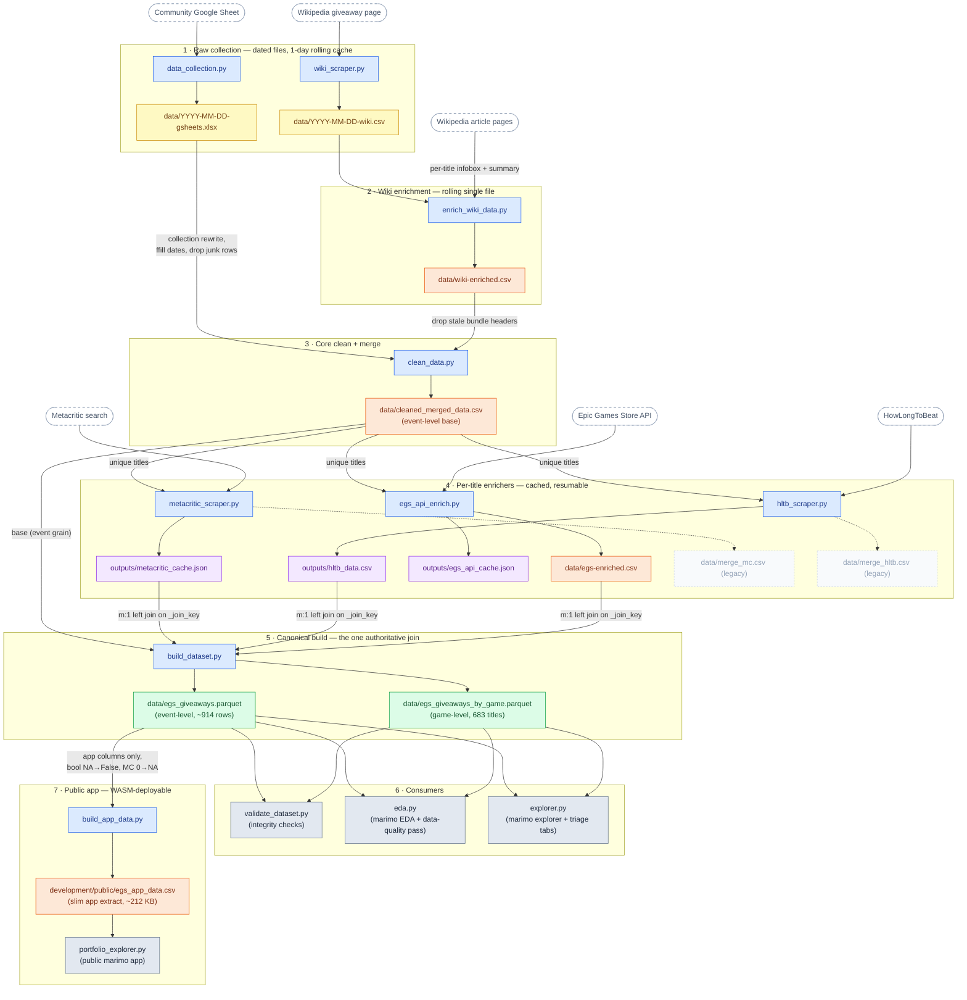

# EGS Pipeline Diagram

A map of how data flows through this repo: which script produces what, where merges happen,
and where cleaning/matching decisions get made. The chart stays terse on purpose — the numbered
stage notes below it carry the plain-English detail, and the tables at the bottom are the
diagnostic cheat sheet ("this looks wrong, where did it get touched?").

> Maintenance: update this file whenever the pipeline structure changes — a script is added,
> renamed, or retired, an input/output file moves, or join/cleaning logic changes.
> (See "Agent habits" in AGENTS.md.)

## The pipeline

**Color legend** — 🟦 blue: scripts · 🟨 yellow: dated raw scrapes · 🟧 orange: rolling intermediates
(single copy, overwritten) · 🟪 purple: per-title caches (survive re-runs; delete to force a re-scrape) ·
🟩 green: canonical outputs (the analysis surface) · ⬜ gray: consumers · dashed: external sources
and legacy/debug files.

## Stage notes (plain English)

### 1 · Raw collection
- `data_collection.py` downloads the community Google Sheet as xlsx (also captures cell **fill
  colors** from column 6 into `COLOR_CATEGORY` — that context only exists in the xlsx, not a csv).
- `wiki_scraper.py` scrapes the Wikipedia giveaway-history page.
- Both skip re-scraping if today's file already exists (1-day freshness rule), keep one prior
  successful scrape as fallback, and name outputs `YYYY-MM-DD-sourcetype`.

### 2 · Wiki enrichment
- `enrich_wiki_data.py` takes the **newest** raw wiki csv, then fetches each title's English
  Wikipedia article for infobox fields (developer, publisher, genre, release date) plus a summary.
- Writes a single rolling `data/wiki-enriched.csv` — old dated enriched copies are cleaned up.

### 3 · Core clean + merge (`clean_data.py`)
This is where most row-level cleaning lives:
- **Collection rewrite** (gsheets side): rows where a collection header sits in `Title` and the
  actual games sit in `NOTES` get flipped — the game moves into `Title`, and `NOTES` becomes
  `Part of collection: <name>`. Happens *before* forward-filling dates so the real title survives.
- **Forward-fill** of `FROM/TO/DAY/DAYS` down through multi-game giveaway blocks.
- **Junk row drops**: blank/`-`/`nan` titles, `TYPE == "*"` rows, trailing header echo.
- **Bundle-header drop** (wiki side): rows whose title matches `collection|trilogy` are dropped
  *only when* the same date-range/source group also contains the component game rows.
- **The merge**: gsheets **left join** wiki on `merge_title` = lowercase, strip all
  non-alphanumerics, collapse whitespace. Wiki columns get the `_wiki` suffix. Unmatched gsheets
  rows survive with NA wiki fields — a NA `title_wiki` means "no wiki match", not a scrape failure.

### 4 · Per-title enrichers
All three read **unique titles** from `cleaned_merged_data.csv`, keep a per-title cache so re-runs
only fetch new titles, and are rate-limit polite. Their matching strategies differ — this is the
first place to look when an enrichment value looks like it belongs to the wrong game:

| Enricher | Match strategy | Threshold | On weak match |
|---|---|---|---|
| `metacritic_scraper.py` | exact lowercase title match against search results, else **first result** | none | silently takes first result — least guarded matcher |
| `hltb_scraper.py` | normalized-title scorer with sequel-number guard, safe-suffix stripping, `SequenceMatcher` ratio | `0.84` | leaves the row blank (no match recorded); ~550/686 titles matched |
| `egs_api_enrich.py` | `fuzz.token_set_ratio` + normalized ratio vs API search results | `80.0` | flags it `egs_meets_threshold = False`; the cache keeps the raw guess but the **output nulls all substantive fields** for it. ~24 titles carry `MANUAL_OVERRIDES` (pin the exact listing / force no-match / null a bogus $0 price), verified against the live store July 2026 |

- `merge_mc.csv` / `merge_hltb.csv` are legacy per-enricher merged files from the old parallel
  pipeline — debug only, schemas drifted; nothing downstream should read them.

### 5 · Canonical build (`build_dataset.py`)
- **Grain**: base is event-level (one row per giveaway occurrence, repeats preserved — Bloons TD 6
  appears 12 times). Enrichments are game-level and **fan out** onto events.
- Joins use `_join_key` = strip + collapse whitespace only (⚠️ *not* the same normalization as
  stage 3's `merge_title` — see join-key table below).
- Each join is `how="left", validate="m:1"` — duplicate keys in an enrichment source raise loudly
  instead of silently inflating row counts.
- Renames gsheets-era columns to snake_case (`FROM`→`from_date`, etc.), derives `giveaway_year`
  and `is_repeat` (any `TYPE` starting with `dupe`).
- Snapshot corrections (July 2026 review): folds case-variant duplicate titles onto one canonical
  spelling (`CANONICAL_TITLES` — ARK/Sifu/Remnant), relabels the transient `next` marker rows to
  standard (provenance appended to `notes`), and derives `is_standalone_game` (playable game vs
  DLC/pack/in-game content; pattern + curated exception lists).
- Also writes `.csv` mirrors next to the parquets. The game-level table is derived from the
  event-level one (giveaway counts + first/last dates per title).

### 6 · Consumers
- `validate_dataset.py`: errors fail, warnings are tolerated. Run after any rebuild.
- `eda.py` (marimo): EDA that doubles as a data-quality pass — ends with a Data Issues list.
- `explorer.py` (marimo): Explore tab (filters incl. the `egs_meets_threshold` "confident matches
  only" switch) + Triage tab (data-quality monitor; the original `REVIEW_NEEDED.md` A–E questions
  were resolved July 2026, the tables remain as regression checks).

### 7 · Public app (`build_app_data.py` → `portfolio_explorer.py`)
- `build_app_data.py` cuts a slim event-level CSV (`development/public/egs_app_data.csv`) with
  only the columns the public app renders — **rerun it after any canonical rebuild** or the app
  serves stale data. It applies two display-layer transforms the canonical dataset does *not*
  have: NA booleans → `False`, and `mc_criticScore == 0` → NA (the scraper's "no score yet"
  sentinel, 72 titles — see `REVIEW_NEEDED.md`). If the app disagrees with the parquet on
  score counts, this is why.
- `portfolio_explorer.py` (marimo) is the public-facing explorer. It reads the extract via
  `mo.notebook_location()/public/`, which resolves to the notebook dir locally and the site URL
  when exported with `marimo export html-wasm … --mode run --no-show-code` (fully client-side
  Pyodide; the `public/` folder is copied into the export automatically). The exported site in
  `outputs/portfolio_wasm/` is a gitignored build artifact.

## Join keys at a glance

Three different title-normalization schemes exist. If a game matched in one stage but not another,
this table is usually why:

| Where | Key | How it's built | Gotcha |
|---|---|---|---|
| Stage 3 merge (`clean_data.py`) | `merge_title` | lowercase → strip non-alphanumerics → collapse spaces | most aggressive; "Control™" and "control" collide (intended) |
| Stage 5 joins (`build_dataset.py`) | `_join_key` | strip → collapse spaces (case & punctuation **kept**) | works because enricher caches store the *original* cleaned title back; a title edited in stage 3 orphans its cache entries |
| HLTB internal scoring | `normalize_title()` | NFKD ascii-fold + lowercase + more | only affects match *quality*, not the join back (which uses `Original_Title`) |

## Where to look when something's wrong

| Symptom | First place to look |
|---|---|
| Game has wrong dates / duration | stage 3 forward-fill + collection rewrite (`clean_data.py`) |
| Collection name shows as a game | `rewrite_collection_rows` (gsheets) or `drop_wiki_bundle_headers` (wiki) in `clean_data.py` |
| Wiki fields all NA for a title | title-spelling mismatch on `merge_title`; compare raw wiki csv vs gsheets title |
| Metacritic score looks like a different game | no-threshold first-result fallback in `metacritic_scraper.py`; fix via `outputs/metacritic_cache.json` |
| HLTB fields blank | conservative matcher scored < 0.84 — check `outputs/hltb_data.csv` for the blank row |
| EGS price/tags look off | check `egs_meets_threshold` and `egs_notes`; low-confidence rows are nulled in output, and `MANUAL_OVERRIDES` in `egs_api_enrich.py` is where known-bad matches get pinned/skipped |
| Row count inflated after rebuild | a cache grew duplicate keys — `validate="m:1"` in `build_dataset.py` should have raised; check its output |
| Enrichment stale after title cleanup | caches key on the old title; delete the entry from the relevant cache file and re-run that enricher |
| Canonical tables disagree with csv mirrors | mirrors are written in the same run; a partial/failed run can leave them out of sync — rebuild |

## Dev / QA tools (not in the chart)

| Script | Role |
|---|---|
| `development/spotcheck.py` | manual spot-checks; must stay in sync with pipeline assumptions (rolling wiki-enriched file, collection rules) |
| `development/egs_api_workbench.py` | marimo workbench for manual Epic API poking / slug QA before promoting logic |
| `development/direct_egs_scraper.py` | earlier direct-API experiment; logic promoted into `egs_api_enrich.py` |
| `development/scrape_sheet.py` | notebook-style dev script, not part of the production flow |
